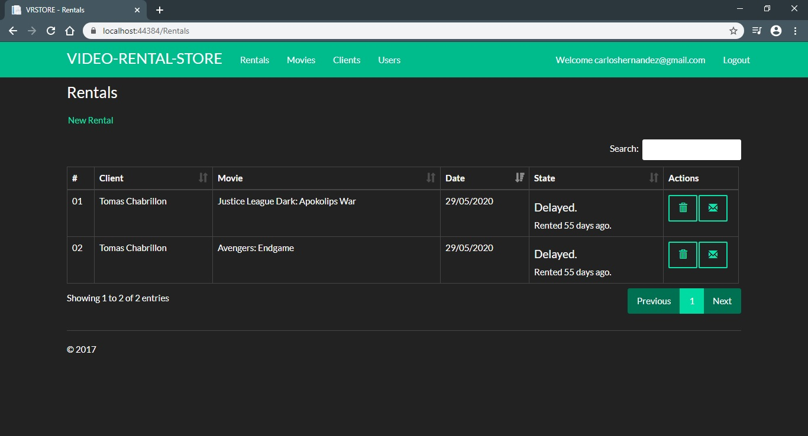
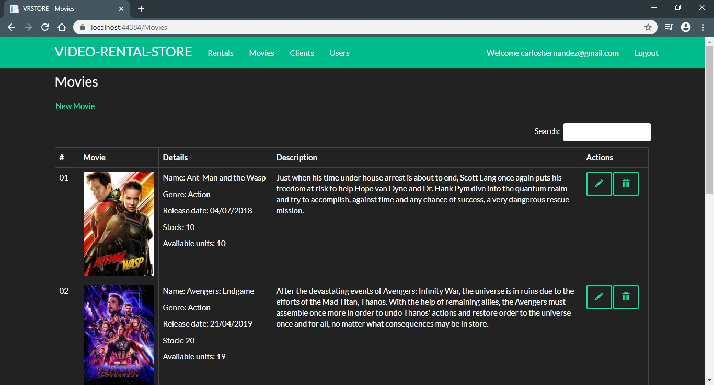
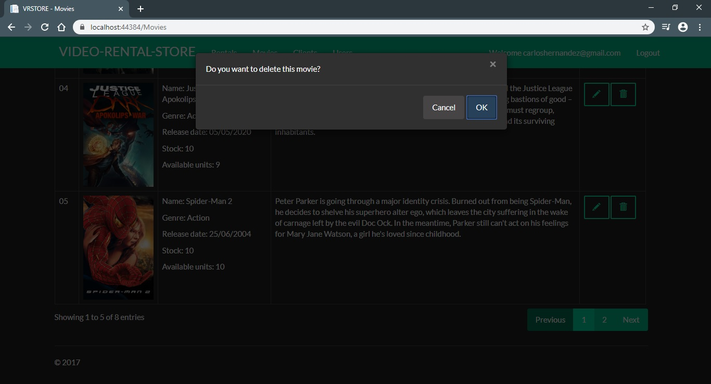

# ASP.NET MVC 5 -Video-Rental-Store

A movie store management system developed using ASP.NET MVC 5.

## Technologies
- ASP.NET MVC 5
- AutoMapper
- Autofac
- Entity Framework 6
- Microsoft SQL Server
- Bootbox
- Bootstrap 3
- jQuery
- jQueryDataTables
- Toastr
- Typeahead

## Screenshots

## Resources

- *[Getting started with ASP.NET MVC 5](https://docs.microsoft.com/en-us/aspnet/mvc/overview/getting-started/introduction/getting-started)*
- *[Entity Framework Tutorial](https://www.entityframeworktutorial.net/entityframework6/introduction.aspx)*
- *[The Complete ASP.NET MVC 5 Course](https://www.udemy.com/course/the-complete-aspnet-mvc-5-course/)*
